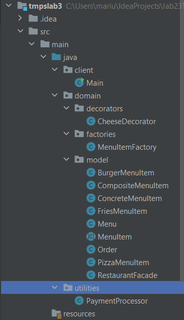
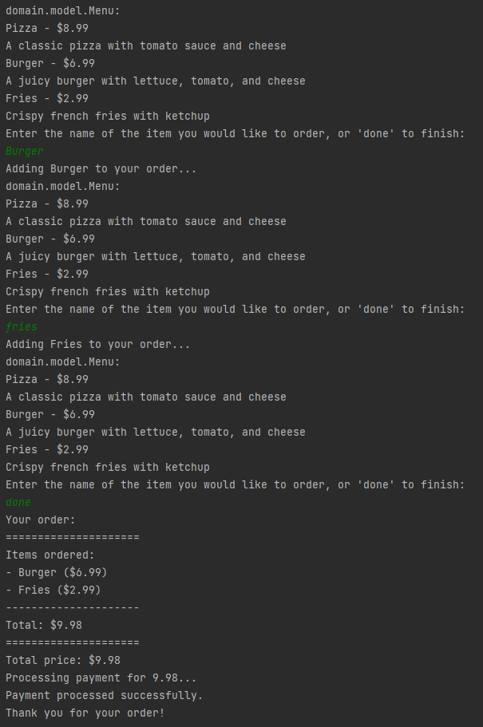

# Restaurant Ordering System

This is a simple restaurant ordering system that allows customers to place orders for various items on the menu.

## Overview

The system is designed using the following design patterns:

1. Composite: The MenuItem class is designed using the Composite pattern, as it represents both individual menu items (e.g. pizza, burger, fries) and composite menu items (e.g. meal deals that include multiple items). The MenuItem class has a List of child MenuItem objects, and its methods can operate recursively on both individual items and composite items.
2. Decorator: The OrderItem class is designed using the Decorator pattern, as it allows additional behavior to be added to a MenuItem object at runtime. The OrderItem class wraps a MenuItem object and adds the quantity and any customization or additional notes to the order.
3. Facade: The Order class is designed using the Facade pattern, as it provides a simplified interface for clients to place and manage orders. Clients can simply create an instance of the Order class, add items to the order, and retrieve a summary of the order, without needing to interact directly with the MenuItem or OrderItem classes.
4. Flyweight: The MenuItemFactory class is designed using the Flyweight pattern, as it caches previously created MenuItem objects and returns them instead of creating new ones, thus minimizing the memory footprint of the application.

## Project Structure

Code fragments
Here are some code fragments that illustrate the use of the design patterns in the project:

## Composite

    public abstract class MenuItem {
    private String name;
    private double price;
    private List<MenuItem> items = new ArrayList<>();

    public MenuItem(String name, double price) {
        this.name = name;
        this.price = price;
    }

    public void add(MenuItem item) {
        items.add(item);
    }

    public void remove(MenuItem item) {
        items.remove(item);
    }

    public List<MenuItem> getItems() {
        return items;
    }

    // ...
    }

## Decorator

    public class OrderItem {
    private MenuItem menuItem;
    private int quantity;
    private String notes;

    public OrderItem(MenuItem menuItem, int quantity, String notes) {
        this.menuItem = menuItem;
        this.quantity = quantity;
        this.notes = notes;
    }

    public double getPrice() {
        return menuItem.getPrice() * quantity;
    }

    // ...
    }

## Facade

    public class Order {
    private static int nextOrderNumber = 1;
    private int orderNumber;
    private List<OrderItem> items = new ArrayList<>();

    public Order() {
        this.orderNumber = nextOrderNumber++;
    }

    public void addItem(MenuItem item, int quantity, String notes) {
        items.add(new OrderItem(item, quantity, notes));
    }

    public double getTotal() {
        return items.stream().mapToDouble(OrderItem::getPrice).sum();
    }

    // ...
    }

## Flyweight
    public class MenuItemFactory {
    private static final Map<String, MenuItem> itemsCache = new HashMap<>();

    public static MenuItem getMenuItem(String name, double price) {
        String key = name + "_" + price;
        if (!itemsCache.containsKey(key)) {
            itemsCache.put(key, new MenuItem(name, price));
        }
        return itemsCache.get(key);
    }

    // ...
    }

## Results

## Conclusion

In conclusion, this project demonstrates how the Composite, Decorator, Facade, and Flyweight patterns can be used to design a simple restaurant ordering system that is flexible, extensible, and efficient. The MenuItem class uses the Composite pattern to represent both individual items and composite items, and the OrderItem class uses the Decorator pattern to add behavior to a MenuItem object at runtime. The Order class uses the Facade pattern to provide a simplified interface for clients to manage orders, and the MenuItemFactory class uses the Flyweight pattern to minimize the memory footprint of the application by caching previously created MenuItem objects. Together, these design patterns make the system more robust, maintainable, and scalable.